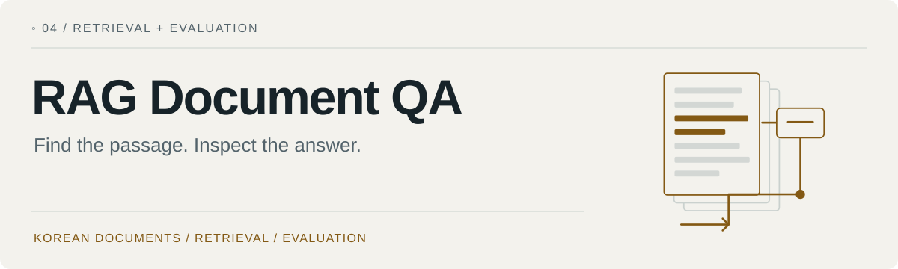
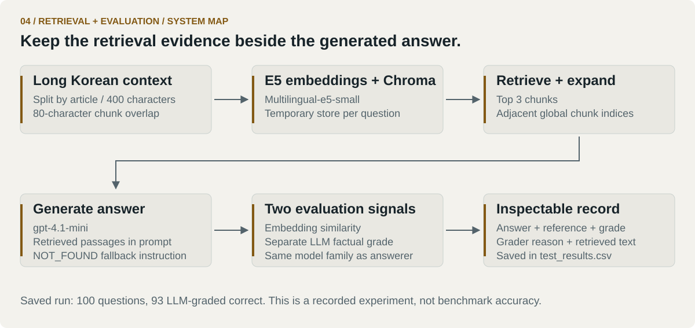

<picture>
  <source media="(prefers-color-scheme: dark)" srcset="docs/assets/portfolio/hero-dark.svg">
  
</picture>

[Colin's portfolio](https://github.com/loopedlol) · [Pipeline](#pipeline) · [Saved results](#results) · [Run the experiment](#start)

A compact retrieval-augmented question-answering experiment over long Korean documents. It keeps **retrieved evidence, generated answers, reference answers, and grading explanations together**, so a score can be followed back to an individual case.

<kbd>Python</kbd> <kbd>Chroma</kbd> <kbd>multilingual-e5-small</kbd> <kbd>Recorded experiment</kbd>

The motivating question: can a small retrieval pipeline find the information an answer needs, and can I tell where it fails?

<a id="pipeline"></a>
## 01 / An inspectable open-book test

<picture>
  <source media="(prefers-color-scheme: dark)" srcset="docs/assets/portfolio/system-dark.svg">
  
</picture>

| Stage | Implementation |
| --- | --- |
| Prepare | [data_embedder.py](data_embedder.py) splits article contexts into 400-character chunks with 80-character overlap and adds E5 passage prefixes. |
| Retrieve | [search_engine.py](search_engine.py) retrieves three chunks, expands to neighboring global chunk indices, deduplicates, and orders the context. |
| Answer | The same module asks `gpt-4.1-mini` to use the retrieved text and return `NOT_FOUND` when evidence is missing. This is a prompt instruction, not a grounding guarantee. |
| Evaluate | [answer_checker.py](answer_checker.py) computes embedding similarity and obtains a separate factual grade from `gpt-4.1-mini`. |
| Preserve | [model_tester.py](model_tester.py) records both scores and the exact supplied context in [test_results.csv](test_results.csv). |

Neighbor expansion follows global chunk indices, so it can cross an article boundary. Each question builds and then removes its own temporary Chroma store.

<a id="results"></a>
## 02 / Read the saved run carefully

| Saved artifact | Observation |
| --- | ---: |
| Questions | 100 |
| LLM grades marked correct | 93 |
| LLM grades marked incorrect | 7 |
| Dataset slice | First 100 Ko-LongRAG test questions |

These counts come from the checked-in [CSV](test_results.csv), not a new evaluation run. **93/100 is the grader's recorded outcome, not independently established benchmark accuracy.** Generation and grading use the same model family, the slice is small and fixed, and no dedicated retrieval benchmark is included.

A revealing failure is **test 84**: its embedding similarity is about **0.991**, yet the factual grader marks it incorrect. Similar wording and factual agreement are different signals. [Results reading guide](docs/RESULTS.md).

<details>
<summary>Inspect the seven failures without making API calls</summary>

The saved incorrect cases are test numbers **16, 46, 47, 56, 84, 89, and 98**. These are the CSV's zero-based `test_number` values.

Read `question`, `actual_answer`, `generated_answer`, `llm_reason`, and `found_context` together. The grader is another model, so its verdict also needs scrutiny.

</details>

<a id="start"></a>
## 03 / Run the experiment

```bash
git clone https://github.com/loopedlol/RAGDocumentQA.git
cd RAGDocumentQA
python -m venv .venv
source .venv/bin/activate
python -m pip install -r requirements.txt
cp .env.example .env
```

On Windows, activate with `.venv\Scripts\activate`. Set `OPENAI_API_KEY` in your local `.env`, then:

```bash
python model_tester.py
```

The script downloads the dataset/model resources, evaluates rows 0–99, makes paid external API calls for answering and grading, and writes `test_results.csv`. **Copy the saved CSV elsewhere before rerunning if you want to retain it**; the script writes to the same filename. Retrieved passages and reference answers are sent to the configured API, so use only material you are authorized to send.

There is no command-line configuration layer: retrieval count, model, and experiment size are currently defined in the source. Dependency versions are not pinned in this project.

## 04 / Limits and next questions

- The LLM grader can be wrong; there is no independent human adjudication in the saved artifact.
- Retrieval failure and answer-generation failure are not separately measured.
- The small, fixed dataset slice does not establish performance on other documents or queries.
- Rebuilding vector stores and scanning all stored passages for neighbors adds work per question.
- A run is written out at the end; interrupted runs do not preserve a completed per-question CSV.

Useful next experiments would isolate retrieval recall, compare neighbor expansion against a controlled baseline, and test another disjoint slice with human-reviewed failures. These are proposed directions, not completed results.

The source data is [LGAI-EXAONE/Ko-LongRAG](https://huggingface.co/datasets/LGAI-EXAONE/Ko-LongRAG). Dataset terms and provenance belong to its original documentation.
---

[← Portfolio](https://github.com/loopedlol) · [Related: temporal vision](https://github.com/loopedlol/SignLanguageAI) · [Visual assets](docs/VISUALS.md)

<sub>Colin / loopedlol · Field Notes · 2026</sub>
